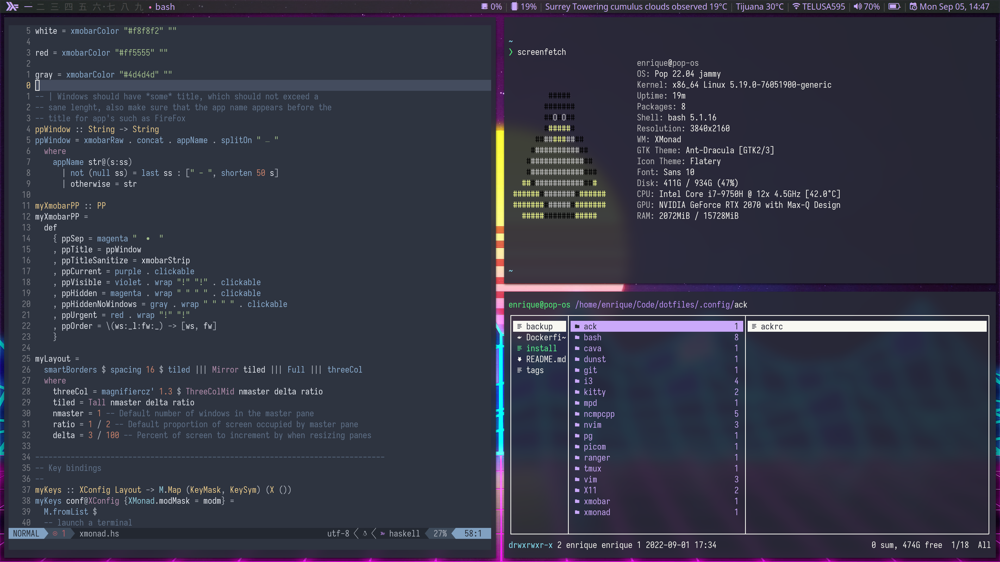

# Xmonad

Before you can start using this config of xmonad you will need to install xmonad, xmonad-contrib and xmobar
I would recommend fetching from git as it will ensure every one of the new features work.

Start by fetching xomnad and xmonad-contrib into your xmonad config director, and add a `stack.yml` like this:

```yaml
resolver:
  url: https://raw.githubusercontent.com/commercialhaskell/stackage-snapshots/master/lts/18/9.yaml

packages:
- xmonad
- xmonad-contrib
```

Once you've done this run `stack install` and add xmonad to GDM by adding this file:

```
[Desktop Entry]
Name=Xmonad
Type=XSession
Comment=Xmonad tiling window manager
Exec=/path/to/your/xmonad-binary
```

Starting xmonad should look similar to this:


