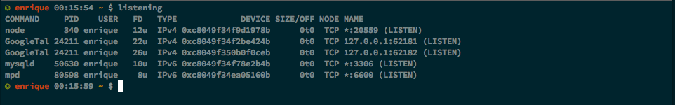

# Bash

## Your Bash config isn't enough for me

It is likely you have defined functions or aliases not contained in this config and you are worried to upgrade and lose them, in order to kep them and load them
you only need to create a file named `.bash_profile.before` which will be loaded before our `.bash_profile` and a file named `.bash_profile.after` which will
be loaded after.

### $PATH

We always put `./bin` and `$HOME/bin` at the begining of `$PATH`.

```bash
export PATH=./bin:$HOME/bin:$PATH
```

The idea is that you can just put any script into any bin folder and the home folder and  bash will know to look there or `$HOME/bin` before trying your system `bin` or
hombrew's path. If you need to change `$PATH` it is recommended that you do so at th `.bash_profile.before`, if that's not a possibility you can always move this line to
`.bash_profile.after`.

## Checkout what's listening

Our bash config includes a `listening` alias that shows what is listening and in what port here's how it looks:




## Command Prompt

Our bash config includes a couple of git related functions `current_git_branch` and `current_git_stash` all these do is check the what the current `git` branch is if we're in a git
project and color it green, `current_git_stash` check how many elements are in the `git` stash (if any) and put the count into brackets, and color it pink. There's another function
not git `last_return_status` related that checks the last return code and pring a green smiley or a red frowny.

This is how all three functions looked combined in `$PROMPT_COMMAND`:


