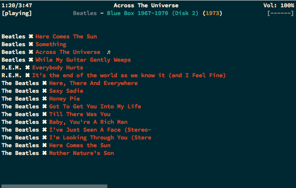
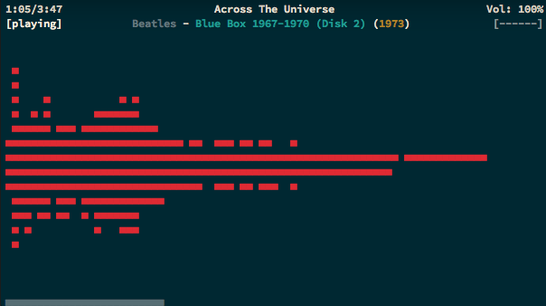
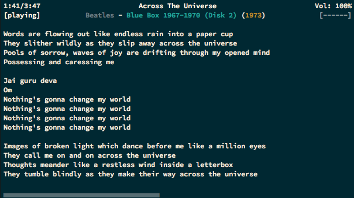

# ncmpcpp

A quick google search will tell you that ncmpcpp is a c++ client for the mpd server, that said
this config files are only of ncmpcpp and not for mpd.

## Looks

The config is mostly an appareance improvement, [here's](http://dotshare.it/dots/1077/) the original
thanks to [bamburuncing](http://dotshare.it/~bamburuncing/).

Here's how it looks for me ( I'm using the Solarized therminal theme colorscheme ).

## Compiling

If you want visualizer and clock support, and you're in a mac using homebrew you'll have to compile
with the necessary flags for it.

`brew install ncmpcpp --with-clock --with-visualizer`

### Visualizer

It's not enough to have visualizer support and `visualizer_fifo_path` configured, mpd needs to configure
the visualizer `audio_output`.

#### Choppy sound?

You may wonder why this section is under the [visualizer][#visualizer] section, the reason is if you
configure your visualizer `audio_output` in mpd, ncmpcpp will try to sync with mpd to get the visualizer
data.

`visualizer_sync_interval=30`

30 is usually regarded as where the sane values start, however if you're experiencing choppy sound you
can gradually take the `visualizer_sync_interval` value down, or disabling the visualizer altogether.

## Documentation

The Arch linux [documentation](https://wiki.archlinux.org/index.php/Ncmpcpp), explains in good detail
what ncmpcpp most important configuration options do and other neat things like UI keys.
